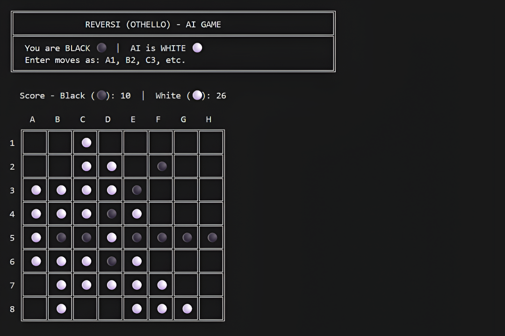

# Reversi (Othello) - With AI

A sophisticated command-line implementation of the classic Reversi (Othello) board game featuring an intelligent AI opponent powered by the Minimax algorithm with Alpha-Beta pruning.



## Overview

This Reversi implementation offers a challenging single-player experience against an AI opponent. The game features a clean, Unicode-based console interface with proper cross-platform support for both Windows and Linux systems. The AI uses advanced game theory techniques to provide a competitive and engaging gameplay experience.

## Features

### Core Gameplay
- **Single-player mode** against an intelligent AI opponent
- **Classic 8x8 board** with standard Reversi rules
- **Real-time score tracking** throughout the game
- **Move validation** to ensure only legal moves are accepted
- **Auto-pass detection** when no valid moves are available
- **Game-over detection** with final score calculation

### Visual Design
- **Unicode-based graphics** for elegant board rendering
- **Color-coded pieces** (Black ⚫ vs White ⚪)
- **Box-drawing characters** for professional board appearance
- **Clear screen functionality** for clean display updates
- **Responsive layout** with row and column labels

### AI Intelligence
- **Minimax algorithm** with Alpha-Beta pruning optimization
- **Configurable search depth** (default: 4 levels)
- **Strategic evaluation** considering:
  - Piece count differential
  - Corner control (weighted heavily)
  - Edge positioning (moderate weight)
  - Overall board position

## Technical Specifications

- **Language**: C++
- **AI Algorithm**: Minimax with Alpha-Beta pruning
- **Search Depth**: 4 levels (configurable)
- **Board Size**: 8x8 grid (64 squares)
- **Encoding**: UTF-8 for Unicode character support

## How to Play

### Starting the Game
1. Run the compiled executable
2. You play as **BLACK (⚫)**
3. AI plays as **WHITE (⚪)**
4. Black always moves first

### Making Moves
- Enter moves using **chess-like notation**: `A1`, `B2`, `C3`, etc.
- **Column** is specified by letter (A-H)
- **Row** is specified by number (1-8)
- Moves are **case-insensitive** (a1 = A1)

### Example Moves
```
Valid inputs:
A1, a1, H8, h8, D4, d4

Invalid inputs:
I9 (out of bounds)
AA (wrong format)
1A (reversed format)
```

## 📖 Game Rules

### Objective
Have the **majority of your colored pieces** on the board at the end of the game.

### How to Play
1. **Place a piece** on the board where it will flip at least one opponent's piece
2. **Flipping occurs** when your piece "sandwiches" opponent pieces between your new piece and an existing piece
3. **Flipping is mandatory** if a valid move exists
4. **Direction**: Flipping can occur horizontally, vertically, or diagonally
5. **Passing**: If no valid move exists, turn is passed to opponent
6. **Game ends** when neither player has a valid move

### Winning
- The player with the **most pieces** wins
- If counts are equal, the game is a **tie**

## AI Strategy

The AI opponent uses a sophisticated strategy combining:

### Evaluation Criteria
1. **Piece Count** (base evaluation)
   - Difference between AI pieces and player pieces

2. **Corner Control** (weight: 25 points)
   - Corners are highly valuable (cannot be flipped)
   - Prioritizes capturing and defending corners

3. **Edge Control** (weight: 5 points)
   - Edge positions provide strategic advantages
   - More stable than internal positions

### Search Algorithm
- **Minimax**: Explores game tree to find optimal moves
- **Alpha-Beta Pruning**: Eliminates unnecessary branches for efficiency
- **Depth Limit**: Searches 4 moves ahead (configurable)
- **Position Evaluation**: Considers both immediate and future board states

## Algorithm Details

### Minimax Implementation
The AI uses a **recursive Minimax algorithm** that:
1. Explores all possible moves for both players
2. Evaluates terminal positions using the evaluation function
3. Propagates scores back up the game tree
4. Selects moves that maximize AI advantage

### Alpha-Beta Pruning
Optimization technique that:
- Maintains **alpha** (best score for maximizer)
- Maintains **beta** (best score for minimizer)
- **Prunes branches** where further exploration is unnecessary
- Reduces search space by approximately **50%**

### Time Complexity
- **Without pruning**: O(b^d) where b = branching factor, d = depth
- **With Alpha-Beta**: O(b^(d/2)) in best case
- **Typical performance**: Searches 100,000+ positions in reasonable time

---

**Enjoy the game!** Challenge yourself against the AI and try to master the strategy of Reversi.
